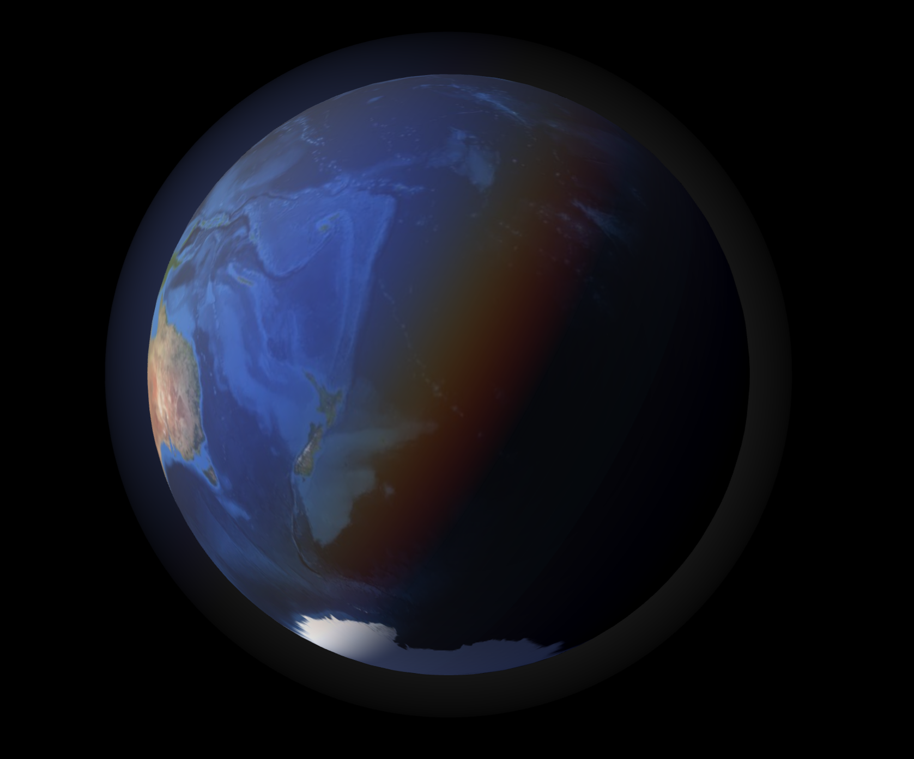

# 🌍 Realistic Globe Renderer
This project is a **Next.js** application that renders a highly realistic 3D globe using **Three.js**.
It features **real-time daylight simulation** based on accurate sun position calculations, creating a dynamic day/night cycle that evolves continuously with the current time.

# ✨ Key Features
**Accurate Sun Positioning**- Calculates the sun’s position for any given time to determine daylight and shadow areas on Earth.

**Rea-Time Day/Night Cycle** - Smooth transitions that reflect the changing light across the globe.

**Rayleigh Scattering Atmosphere**- An enhanced atmospheric effect producing natural blue hues and soft gradients for realistic sky rendering.

**Improved Ope-Source Globe Rendering** - Builds on existing open-source solutions with a more authentic atmosphere and lighting model.

# 🖼️ Preview

